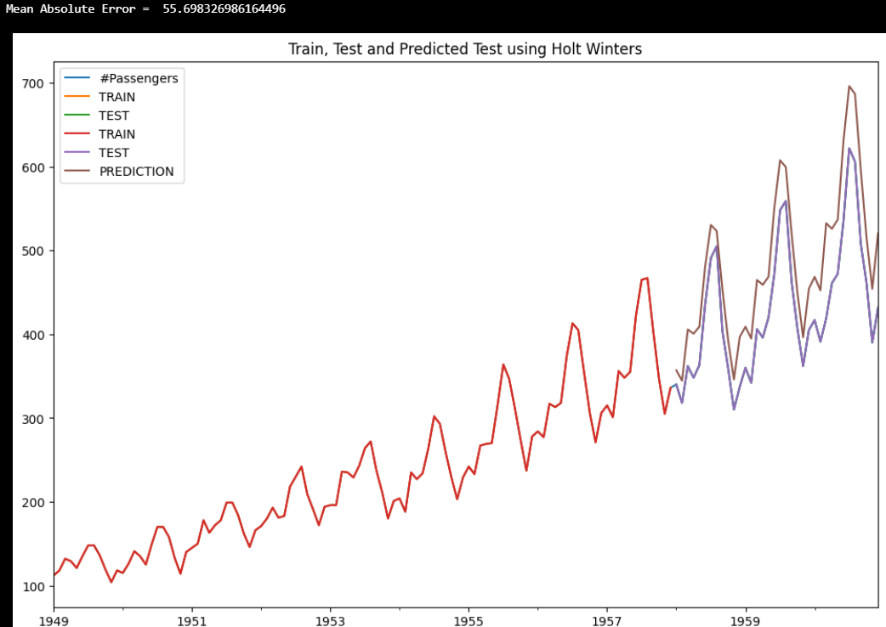
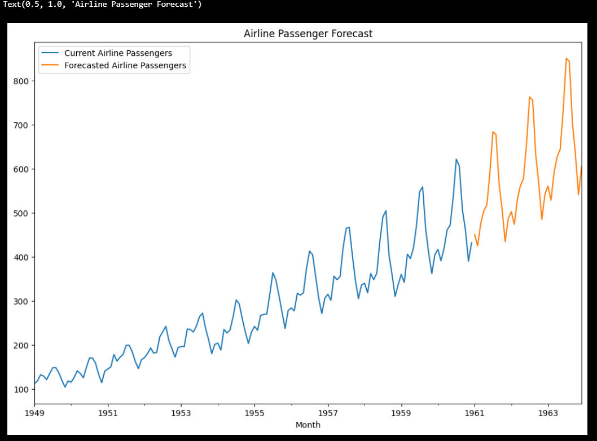

# Ex.No: 6               HOLT WINTERS METHOD
### Date:
### AIM:
  To create and implement Holt Winter's Method Model using python.
### ALGORITHM:
1. You import the necessary libraries
2. You load a CSV file containing daily sales data into a DataFrame, parse the 'date' column as
datetime, and perform some initial data exploration
3. You group the data by date and resample it to a monthly frequency (beginning of the month
4. You plot the time series data
5. You import the necessary 'statsmodels' libraries for time series analysis
6. You decompose the time series data into its additive components and plot them:
7. You calculate the root mean squared error (RMSE) to evaluate the model's performance
8. You calculate the mean and standard deviation of the entire sales dataset, then fit a Holt-
Winters model to the entire dataset and make future predictions
9. You plot the original sales data and the predictions
### PROGRAM:
#### NAME : KAVINRAJA D
#### REG NO : 212222240047
```py
from statsmodels.tsa.holtwinters import ExponentialSmoothing
import matplotlib.pyplot as plt
from sklearn.metrics import mean_absolute_error,mean_squared_error
import pandas as pd

airline  = pd.read_csv('AirPassengers.csv',index_col='Month',parse_dates=True)
airline.plot()
airline.freq = 'MS'
airline.index
len(airline)

train_airline = airline[:108] 
test_airline = airline[108:] 
fitted_model = ExponentialSmoothing(train_airline['#Passengers'],trend='mul',seasonal='mul',seasonal_periods=12).fit()
test_predictions = fitted_model.forecast(36).rename('HW Test Forecast')

test_predictions[:10]
train_airline['#Passengers'].plot(legend=True,label='TRAIN')
test_airline['#Passengers'].plot(legend=True,label='TEST',figsize=(12,8))
plt.title('Train and Test Data');

train_airline['#Passengers'].plot(legend=True,label='TRAIN')
test_airline['#Passengers'].plot(legend=True,label='TEST',figsize=(12,8))
test_predictions.plot(legend=True,label='PREDICTION')
plt.title('Train, Test and Predicted Test using Holt Winters');
print("Mean Absolute Error = ",mean_absolute_error(test_airline,test_predictions))

final_model = ExponentialSmoothing(airline['#Passengers'],trend='mul',seasonal='mul',seasonal_periods=12).fit()
forecast_predictions = final_model.forecast(steps=36)

airline['#Passengers'].plot(figsize=(12,8),legend=True,label='Current Airline Passengers')
forecast_predictions.plot(legend=True,label='Forecasted Airline Passengers')
plt.title('Airline Passenger Forecast');
```
### OUTPUT:
#### TEST_PREDICTION


#### FINAL_PREDICTION



### RESULT:
Thus the program run successfully based on the Holt Winters Method model.
